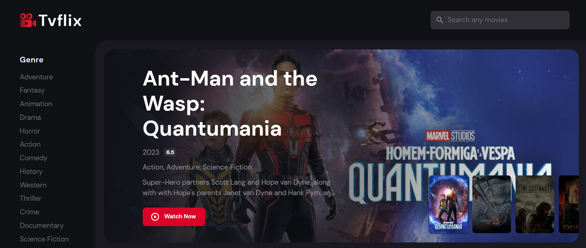
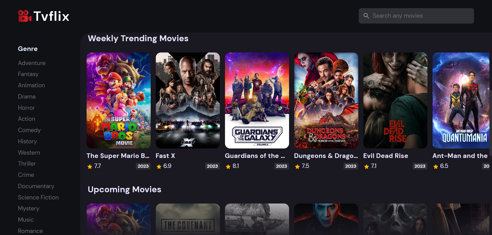
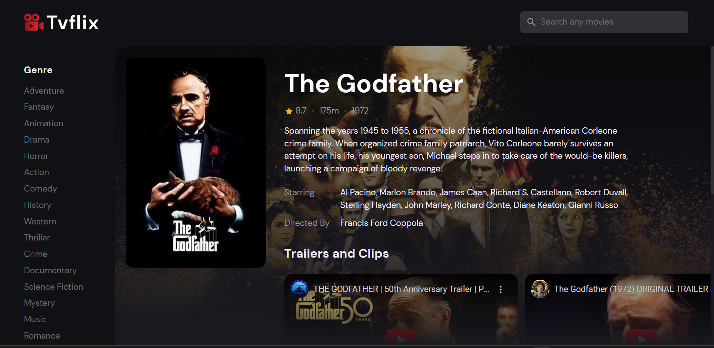

## Online Movie Service Streaming
This project is an online movie service streaming application built using Java Spring Boot. It leverages
the TMDB (The Movie Database) API to fetch movie data and provides users with a platform to browse and stream
a wide collection of movies. With a user-friendly interface and seamless integration of TMDB API, this project aims to
offer an immersive movie-watching experience to users.

## Screenshots

## Features
- User Authentication: Allow users to sign up and log in to the application.
- Movie Browsing: Provide users with the ability to explore movies from various genres.
- Movie Search: Allow users to search for specific movies based on title, genre, or keywords.
- Movie Recommendations: Provide personalized movie recommendations based on user preferences.
- Movie Playback: Implement movie playback controls such as play, pause, seek, and volume control.
- User Reviews and Ratings: Allow users to write reviews and rate movies they have watched.
- Responsive Design: Ensure a seamless user experience across different devices.

## Prerequisites
Before running the application, make sure you have the following installed:
- Node.js - version 14 or above
- NPM - version 7 or above

## Getting Started
Follow these steps to set up and run this project:

- Clone the repository:
git clone git@github.com:silviumartinescu/online-movie-service-streaming.git

- Navigate to the project directory:
cd frontend

- Install the dependecies:
npm install

- Start the development server:
npm run dev

- Open your web browser and visit  http://127.0.0.1:5173/ to access the application.

## Technologies Used
Java Spring Boot - A Java framework for building web applications.
Thymeleaf - A server-side Java template engine for rendering HTML pages.
TMDB API - The Movie Database API for fetching movie data.
HTML5 and CSS3 - Markup and styling for the application.
JavaScript - Client-side scripting for interactivity.
API Integration

## Contributing
Contributions to the Online Movie Service Streaming project are welcome! If you find any issues or have suggestions
for improvement, please feel free to open an issue or submit a pull request.

## License
This project is licensed under the MIT License. Feel free to use and modify the code as per your requirements.

## Acknowledgements
Special thanks to the creators of the TMDB API for providing the movie data and to the open-source community
for the tools and resources used in building this application.

Enjoy streaming your favorite movies!